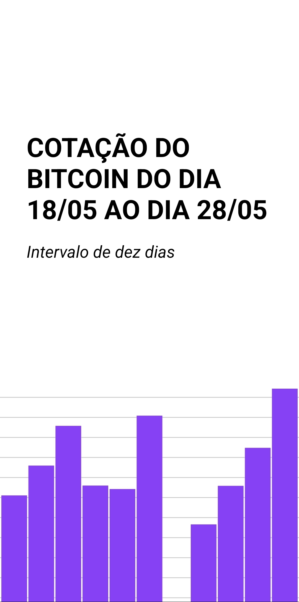
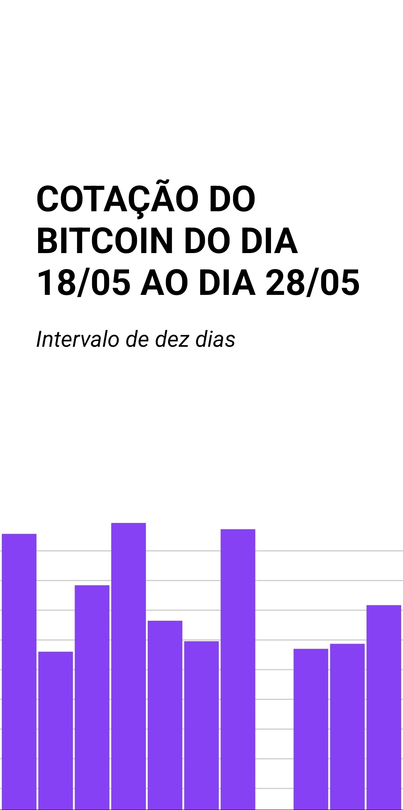

# chart-plotting-demo-app

## Sumário

- [chart-plotting-demo-app](#chart-plotting-demo-app)
  - [Sumário](#sumário)
  - [Motivação](#motivação)
  - [Pilha de tecnologia](#pilha-de-tecnologia)
  - [Galeria](#galeria)
    - [CoinAPI](#coinapi)
    - [CoinGecko](#coingecko)
  - [Como rodar](#como-rodar)
    - [Pré-requisitos](#pré-requisitos)
    - [Passo a passo](#passo-a-passo)

## Motivação

Este app é uma demonstração do módulo [`react-native-svg-charts`](https://www.npmjs.com/package/react-native-svg-charts). Ele utiliza um serviço de consulta da API CoinGecko para retornar a cotação do Bitcoin nos últimos dez dias, sendo o último dia o dia em que o app é iniciado. Uma peculiaridade desse aplicativo é que ele foi projetado com flexibilidade em mente. Ou seja, modificando apenas a classe `CoinGeckoService` pela classe `CoinAPIService`, o app continuará a funcionar normalmente, só que consumindo outra API que traz a mesma informação. Apesar das duas classes implementarem o mesmo método `getQuotationADay`, não há uma interface formal definida. É importante mencionar que, às vezes, as APIs podem retornar erros como [401](https://http.cat/401) (CoinAPI) e [429](https://http.cat/429) (CoinGecko). Nesses casos, é recomendável reiniciar o app para garantir seu correto funcionamento.

Este foi o sexto repositório de código apresentado no [Curso Superior de TSI](https://www.ifms.edu.br/campi/campus-aquidauana/cursos/graduacao/sistemas-para-internet/sistemas-para-internet) do IFMS como requisito para obtenção da nota parcial das atividades da unidade curricular Programação para Dispositivos Móveis I.

| [&larr; Repositório anterior](https://github.com/mdccg/holy-mary) | [Próximo repositório &rarr;](#) |
|-|-|

## Pilha de tecnologia

| Papel | Tecnologia |
|-|-|
| Ambiente de execução | [Node](https://nodejs.org/en/) |
| Plataforma | [Expo](https://expo.dev/) | 
| Linguagem de programação | [JavaScript](https://developer.mozilla.org/pt-BR/docs/Web/JavaScript/) |
| Front-end | [React Native](https://reactnative.dev/) |
| Base de dados<sup>1</sup> | [CoinAPI](https://docs.coinapi.io/) |
| Base de dados<sup>2</sup> | [CoinGecko](http://www.coingecko.com/api) |

## Galeria

### CoinAPI



### CoinGecko



## Como rodar

### Pré-requisitos

- [Node](https://nodejs.org/en/download/);
- [Yarn](https://yarnpkg.com/) (opcional);
- Dispositivo móvel:
  - [Expo Go](https://expo.dev/client).

### Passo a passo

1. Clone o repositório de código em sua máquina;
   
2. Abra um shell de comando de sua preferência (prompt de comando, PowerShell, terminal _etc_.);
   
3. Instale as dependências do projeto através do seguinte comando:

```console
$ npm install
```

Caso esteja utilizando o gerenciador de pacotes Yarn, execute o seguinte comando como alternativa:

```console
$ yarn
```

4. Execute o seguinte comando para iniciar o app:

Para npm:

```console
$ npm run start
```

Para Yarn:

```console
$ yarn start
```

5. Uma vez iniciado, aparecerá um QR Code. Você deve escaneá-lo com o aplicativo [Expo Go](https://expo.dev/client), disponível para Android e iOS;

6. Como alternativa, você pode executar o app no seu navegador, pressionando o atalho `w`. Entretanto, alguns módulos podem não funcionar na versão web do app.

7. Exclusivamente para este repositório de código, você pode executar uma versão similar no meu _snack_[<sup>1</sup>](#nota-de-rodape-1) [mdccg/cotacao-bitcoin](https://snack.expo.dev/@mdccg/cotacao-bitcoin).

<sup id="nota-de-rodape-1">1</sup> _Snack_ refere-se a um recurso do site da Expo onde os desenvolvedores podem criar, visualizar e compartilhar trechos de código-fonte em tempo real usando um ambiente de desenvolvimento on-line. Esses trechos de código-fonte geralmente contêm exemplos de como implementar recursos específicos no React Native, e os usuários podem testá-los instantaneamente em seus próprios dispositivos móveis, sem precisar configurar um ambiente de desenvolvimento em seu computador.
